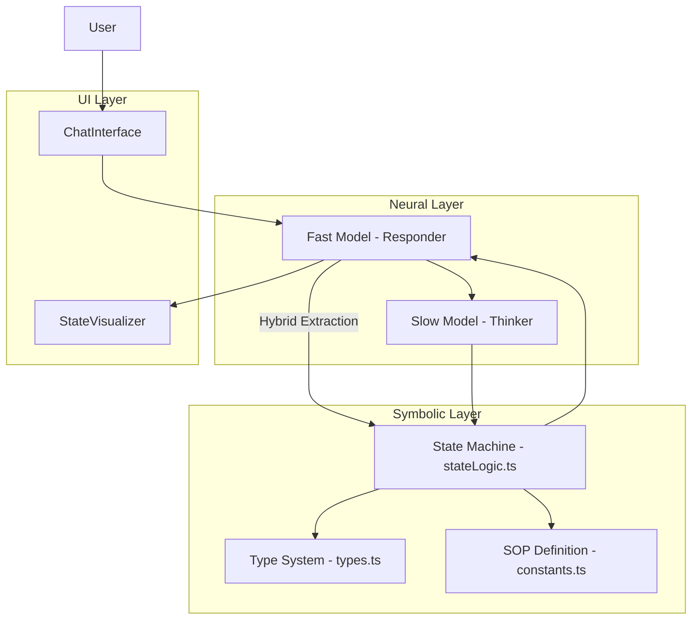
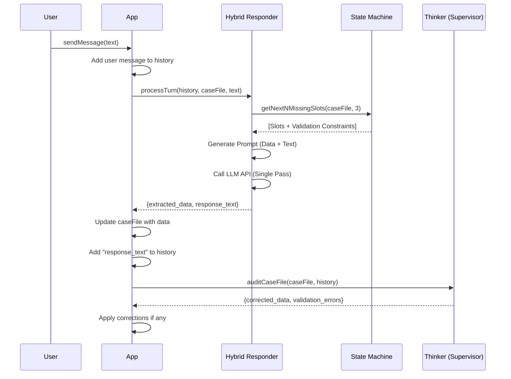
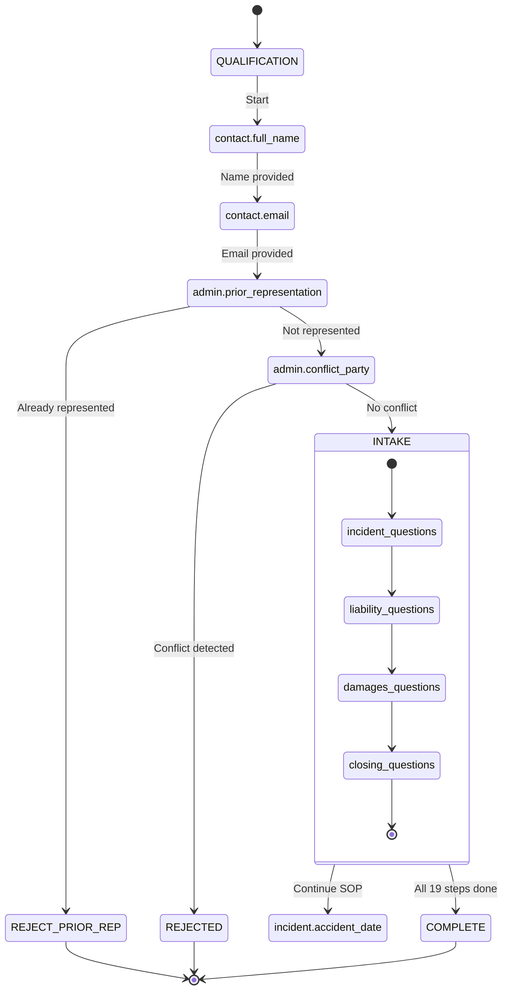
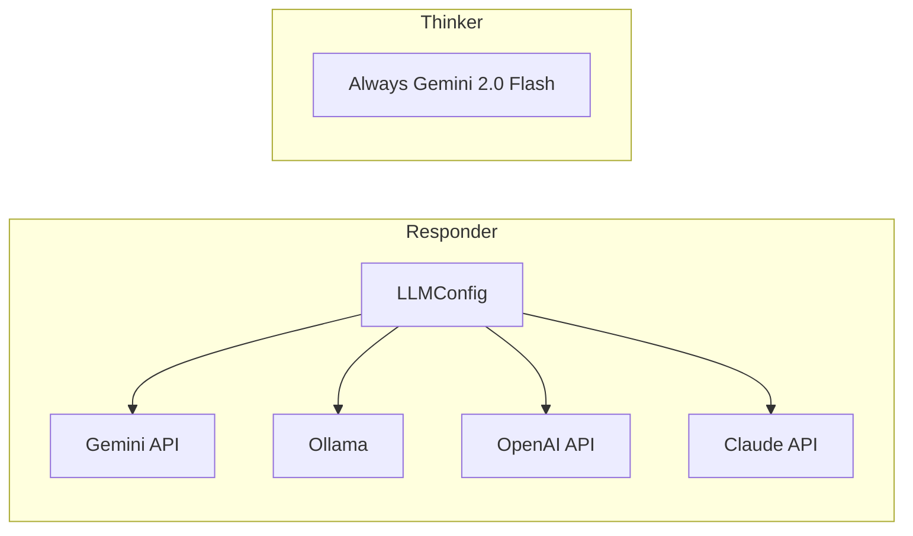

# Architecture Deep Dive

This document provides comprehensive documentation of the Neuro-Symbolic Legal Intake AI system, covering data structures, state management, and routing logic.

## Table of Contents

1. [System Overview](#system-overview)
2. [Data Structures](#data-structures)
3. [State Management](#state-management)
4. [Routing Logic (FSM)](#routing-logic-fsm)
5. [LLM Provider Architecture](#llm-provider-architecture)
6. [Logging System](#logging-system)

---

## System Overview

The application follows a **Neuro-Symbolic Architecture** that separates:

- **Neural Component (System 1)**: LLM-powered conversation and data extraction
- **Symbolic Component (System 2)**: Deterministic state machine for SOP enforcement



---

## Data Structures

### Core Types ([types.ts](file:///Users/nachiket/workspace/github.com/Public/legal-AI-zed/types.ts))

#### 1. CaseFile - The Central State Object

The `CaseFile` is the **Single Source of Truth** for the entire application:

```typescript
interface CaseFile {
  case_id: string;
  status: 'QUALIFICATION' | 'INTAKE' | 'REJECTED' | 'REFERRED' | 'CLOSED';
  rejection_reason?: string;
  contact: ContactVector;
  incident: IncidentVector;
  liability: LiabilityVector;
  damages: DamagesVector;
  admin: AdministrativeVector;
}
```

#### 2. Domain Vectors

Each vector represents a logical grouping of related fields:

| Vector | Purpose | Key Fields |
|--------|---------|------------|
| `ContactVector` | Basic user identification | `full_name`, `email`, `phone_number` |
| `IncidentVector` | Facts of the event | `accident_date`, `location_jurisdiction`, `police_report_filed` |
| `LiabilityVector` | Fault determination | `fault_admission`, `claimant_role`, `witness_presence` |
| `DamagesVector` | Economic/non-economic harm | `injury_details`, `hospitalization_details`, `lost_wages_details` |
| `AdministrativeVector` | Ethics and qualification | `prior_representation`, `conflict_party`, `insurance_status` |

#### 3. Complex Structs (Nested Objects)

Some fields require multi-part answers:

```typescript
// Example: Fault Admission
interface FaultAdmission {
  status: 'Yes' | 'No' | 'Unknown' | null;
  statement: string | null;  // Required if status === 'Yes'
}

// Example: Injury Details
interface InjuryDetails {
  has_injury: boolean | null;
  description: string | null;  // Required if has_injury === true
}
```

**Validation Rule**: If the primary discriminator (e.g., `has_injury`) is `true`, the secondary field (e.g., `description`) becomes required.

---

## State Management

### React State Structure

The application uses React's `useState` for state management:

```typescript
// In App.tsx
const [caseFile, setCaseFile] = useState<CaseFile>(INITIAL_CASE_FILE);
const [messages, setMessages] = useState<Message[]>([...]);
const [llmConfig, setLlmConfigState] = useState<LLMConfig>(getLLMConfig());
```

### State Update Flow



### Deep Merge Strategy

When updating the `CaseFile`, we use a **shallow merge per vector** to prevent data loss:

```typescript
setCaseFile((prev) => {
  const updated = { ...prev };
  const data = result.extracted_data;
  
  // Only update vectors that have new data
  if (data.contact) updated.contact = { ...updated.contact, ...data.contact };
  if (data.incident) updated.incident = { ...updated.incident, ...data.incident };
  if (data.liability) updated.liability = { ...updated.liability, ...data.liability };
  if (data.damages) updated.damages = { ...updated.damages, ...data.damages };
  if (data.admin) updated.admin = { ...updated.admin, ...data.admin };
  
  return updated;
});
```

---

## Routing Logic (FSM)

### Hybrid Logic Layer (System 1.5)

To bridge the gap between Neural extraction and Symbolic rules, we employ **Prompt Constraints**:

- **Dynamic Prompting**: The FSM detects which slots are next (e.g., `contact.full_name`).
- **Constraint Injection**: The system prompt is updated with specific rules for those slots (e.g., "Must be 2+ words").
- **Strict Null Handling**: The prompt forbidden "Thank you" messages if any requested key is returned as `null`. This forces the LLM to prioritize data completeness over conversational politeness.

### Symbolic Validation Layer (The Gatekeeper)

To solve the "Hallucination Problem" (System 1 giving bad data), we implemented a strict symbolic filter in `geminiService.ts`:

1. **LLM Extraction**: `{"contact.full_name": "Nachiket"}` (Single Name)
2. **Validation Check**: `validateField("contact.full_name", "Nachiket")` -> Returns `false` (Must be 2+ words).
3. **Field Rejection**: The key is DELETED from the extraction object.
4. **State Effect**: The FSM sees the field as still `null` and re-queues the question "What is your last name?".

This ensures that only strictly valid data enters the Case File.

### SOP Definition ([constants.ts](file:///Users/nachiket/workspace/github.com/Public/legal-AI-zed/constants.ts))

The Standard Operating Procedure is defined as a linear array:

```typescript
export const INTAKE_STEPS = [
  // 1. Basic Contact Info (Priority High)
  { id: 'contact.full_name', label: 'Full Name', vector: 'Contact' },
  { id: 'contact.email', label: 'Email Address', vector: 'Contact' },
  
  // 2. Gatekeeping & Ethics (Fail Fast)
  { id: 'admin.prior_representation', label: 'Prior Representation', vector: 'Administrative' },
  { id: 'admin.conflict_party', label: 'Conflict Check', vector: 'Administrative' },
  
  // ... continues through all 19 steps
];
```

### State Machine Logic ([stateLogic.ts](file:///Users/nachiket/workspace/github.com/Public/legal-AI-zed/services/stateLogic.ts))

#### Core Functions

##### 1. `isFieldComplete(fieldId, value): boolean`

Determines if a field is fully complete, handling complex struct validation:

```typescript
const isFieldComplete = (fieldId: string, value: any): boolean => {
  if (value === null) return false;
  
  // Complex Struct: Fault Admission
  if (fieldId === 'liability.fault_admission') {
    if (value.status === null) return false;
    if (value.status === 'Yes' && !value.statement) return false;
    return true;
  }
  
  // Complex Struct: Injury Details
  if (fieldId === 'damages.injury_details') {
    if (value.has_injury === null) return false;
    if (value.has_injury === true && !value.description) return false;
    return true;
  }
  
  // Primitives: Not null means complete
  return true;
};
```

##### 2. `getNextMissingSlot(caseFile): string | null`

The main FSM transition function:

```typescript
export const getNextMissingSlot = (caseFile: CaseFile): string | null => {
  // RULE 1: Kill Switch (Ethics)
  if (caseFile.admin.prior_representation === true) return "REJECT_PRIOR_REP";
  if (caseFile.status === "REJECTED") return "REJECTED_GENERIC";
  
  // RULE 2: Linear SOP Scan
  for (const step of INTAKE_STEPS) {
    const [vectorKey, fieldKey] = step.id.split('.');
    const vector = caseFile[vectorKey as keyof CaseFile];
    const value = vector[fieldKey];
    
    if (!isFieldComplete(step.id, value)) {
      return step.id;  // Return first incomplete step
    }
  }
  
  // RULE 3: All complete
  return "COMPLETE";
};
```

##### 3. `getNextNMissingSlots(caseFile, n): Slot[]`

Returns the next N incomplete slots for scoped prompting:

```typescript
export const getNextNMissingSlots = (caseFile, n = 3) => {
  // Returns [{id, instruction}, ...] for next N pending questions
  // Used to scope the Responder's context window
};
```

### FSM State Diagram



---

## LLM Provider Architecture

### Provider Types ([types.ts](file:///Users/nachiket/workspace/github.com/Public/legal-AI-zed/types.ts))

```typescript
type LLMProvider = 'internal' | 'local' | 'openai' | 'claude';

interface LLMConfig {
  provider: LLMProvider;
  apiKey?: string;           // For OpenAI/Claude
  localEndpoint?: string;    // For Ollama
  modelName?: string;        // Override default model
}

// Default models per provider
const DEFAULT_MODELS = {
  internal: 'gemini-flash-lite-latest',
  local: 'llama3.2:1b',
  openai: 'gpt-4o-mini',
  claude: 'claude-3-haiku-20240307'
};
```

### Provider Implementation ([llmProviders.ts](file:///Users/nachiket/workspace/github.com/Public/legal-AI-zed/services/llmProviders.ts))



**Note**: The Thinker (validation model) always uses Gemini's internal API for consistent reasoning quality.

---

## Logging System

### Log Types

#### 1. ApiCallLog (Comprehensive Token Metrics)

```typescript
interface ApiCallLog {
  timestamp: number;
  model: 'responder' | 'thinker';
  provider: LLMProvider;
  modelName: string;
  
  // Input metrics
  inputPrompt: string;
  inputTokens: number;
  
  // Output metrics
  outputString: string;
  outputTokens: number;
  
  // Performance
  timeTakenMs: number;
  
  // Error handling
  error?: string;
}
```

### Console Output Format

```
================================================================================
[RESPONDER] API CALL LOG - internal (gemini-flash-lite-latest)
================================================================================
⏱️  Time Taken: 1234ms
📥 Input Tokens: 450
📤 Output Tokens: 120

📝 INPUT PROMPT:
System: Legal intake. Extract data, ask next question...

💬 OUTPUT STRING:
{"extracted_data": {...}, "response_text": "Thank you..."}
================================================================================
```

---

## File Structure

```
legal-AI-zed/
├── App.tsx                 # Main React component, state management
├── types.ts                # All TypeScript interfaces
├── constants.ts            # SOP definition, initial state
├── services/
│   ├── geminiService.ts    # LLM orchestration, API calls
│   ├── llmProviders.ts     # Multi-provider abstraction
│   └── stateLogic.ts       # FSM implementation
├── components/
│   ├── ChatInterface.tsx   # Chat UI
│   ├── StateVisualizer.tsx # SOP progress + logs
│   └── TranscriptModal.tsx # Final transcript
└── ARCHITECTURE.md         # This file
```
