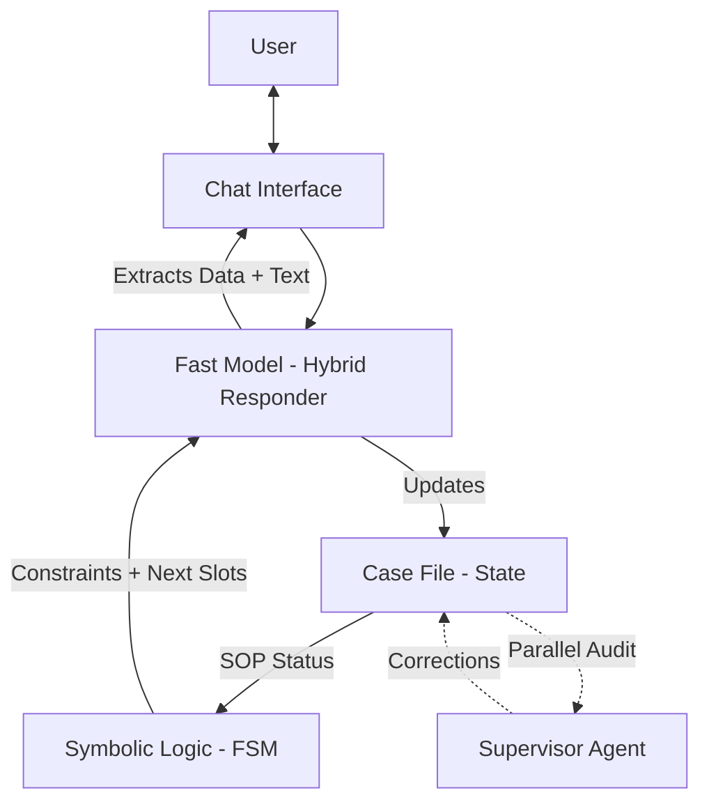

# Neuro-Symbolic Legal Intake AI

A React-based Proof of Concept (POC) demonstrating a **Neuro-Symbolic Architecture** for legal case intake. This system combines the flexibility of Large Language Models with the strict rule adherence of symbolic logic (TypeScript interfaces & State Machines).

<div align="center">

</div>

## 🚀 Key Features

* **Hybrid Responder**: Combines flattened JSON extraction with LLM-generated conversational responses for natural, low-latency interactions.
* **Real-time State Visualizer**: Watch the AI "fill out the form" in real-time as you chat.
* **Supervisor Audit Loop**: A "Slow Thinking" model (Gemini 2.0 Flash) runs in the background to audit the chat and correct data errors.
* **Smart Constraints**: The Responder prompt actively enforces data quality (e.g., "Full Name must be 2 words") before extraction.
* **Strict SOP Adherence**: The AI cannot hallucinate the process; it is constrained by a deterministic Finite State Machine (SOP).
* **Type-Safe Extraction**: Enforces strict TypeScript interfaces (`ContactVector`, `IncidentVector`, etc.) for all data extraction.
* **Multi-Provider LLM Support**: Choose between Gemini (internal), OpenAI, Claude, or local models via Ollama.
* **Comprehensive API Logging**: Track input/output tokens, response times, and full prompt/response content.

## 🛠️ Architecture

The system operates on a **Neuro-Symbolic Hybrid Model**:

1. **Fast Model (Responder)**: A "Hybrid" agent. It extracts data into a flattened JSON schema *and* generates the conversational response in a single pass. This minimizes latency and token usage.
2. **Symbolic Logic (The "Ontology")**: A TypeScript state machine that holds the "Truth". It calculates exactly what data is missing from the `CaseFile` and feeds specific constraints to the Responder.
3. **Slow Model (Thinker)**: A separate Supervisor Agent that reviews the case file in parallel, fixing complex errors and flagging inconsistencies without blocking the user flow.



For a deep dive into the architecture, see [ARCHITECTURE.md](./ARCHITECTURE.md).

## 📦 Run Locally

**Prerequisites:** Node.js (v18+)

1. **Clone the repository**:

    ```bash
    git clone <repository_url>
    cd legal-AI-zed
    ```

2. **Install dependencies**:

    ```bash
    npm install
    ```

3. **Configure Environment**:
    Create a `.env.local` file in the root directory:

    ```env
    # Primary API Key for Internal Gemini Provider
    GEMINI_API_KEY=your_google_gemini_api_key
    # (Backward compatibility: API_KEY also supported)
    ```

4. **Run Development Server**:

    ```bash
    npm run dev
    ```

## ⚙️ LLM Provider Configuration

The system supports multiple LLM providers for the **fast model (Responder)**:

### 1. Internal (Gemini) - Default

Uses the `GEMINI_API_KEY` (or `API_KEY`) environment variable. Fastest option.

### 2. OpenAI

Provide your OpenAI API key through the settings panel in the UI.

* Default model: `gpt-4o-mini`
* Supports JSON mode for structured output

### 3. Claude (Anthropic)

Provide your Anthropic API key through the settings panel.

* Default model: `claude-3-haiku`
* Fast and cost-effective

### 4. Local (Ollama)

Run LLMs locally without an API key.

**Setup Ollama:**

```bash
# Install Ollama (macOS)
brew install ollama

# Start Ollama service
ollama serve

# Pull a fast model
ollama pull llama3.2:1b
```

Configure the endpoint in the settings panel (default: `http://localhost:11434`).

**Note**: The Thinker (validation model) always uses Gemini's internal API for consistent reasoning quality.

## 📊 API Logging

The system provides comprehensive logging for debugging AI calls:

### Logging Details

Each API call logs:

* Input prompt (truncated)
* Input token count
* Output response
* Output token count
* Time taken (ms)
* Provider and model used

Expand the "API Call Logs" section in the State Visualizer to see real-time token metrics and full request/response bodies.

## 📄 Documentation

* [ARCHITECTURE.md](./ARCHITECTURE.md) - Deep dive into data structures, state management, and FSM routing logic
* [report.md](./report.md) - Technical analysis and architectural decisions

## 🧪 Testing

A test response sheet is provided for end-to-end flow testing:

See [test-responses.json](./test-responses.json) for sample responses to all 19 intake questions.

## ⚠️ Deployment & Security

**IMPORTANT UPDATE ON DEPLOYMENT:**

This project is a **Client-Side POC**. It uses the LLM APIs directly from the browser for demonstration purposes.

* **Security Risk**: API keys are embedded in the build. If you deploy to a public URL without protection, **your API keys will be exposed**.
* **Recommendation**:
  * **Private Demo**: Deploy to Vercel with Password Protection or strict API Key restrictions in provider consoles.
  * **Production**: Move `services/geminiService.ts` logic to a backend API (Next.js API Routes, Express, or Edge Functions) to hide API keys.
  * **Local LLM**: Use Ollama for zero API key exposure.

## 📁 Project Structure

```
legal-AI-zed/
├── App.tsx                 # Main React component with LLM settings
├── types.ts                # All TypeScript interfaces
├── constants.ts            # SOP definition, initial state
├── services/
│   ├── geminiService.ts    # LLM orchestration, API calls
│   ├── llmProviders.ts     # Multi-provider abstraction (OpenAI/Claude/Ollama)
│   └── stateLogic.ts       # FSM implementation
├── components/
│   ├── ChatInterface.tsx   # Chat UI
│   ├── StateVisualizer.tsx # SOP progress + detailed API logs
│   └── TranscriptModal.tsx # Final transcript
├── ARCHITECTURE.md         # Detailed architecture documentation
├── test-responses.json     # Sample test data
└── README.md               # This file
```

## License

MIT
